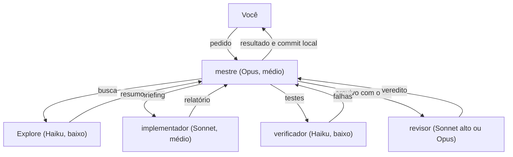

# Equipe de agentes para o Claude Code

Uma sessão principal, o **mestre**, coordena cinco subagentes. Cada um roda no modelo mais barato que dá conta do papel. As regras ficam em camadas, o briefing e o relatório são padronizados, os comandos mais perigosos ficam bloqueados nas configurações e uma guarda limita o terminal dos subagentes: o Explore e o verificador só rodam o que precisam, e o implementador não consegue formatar a pasta inteira.

O objetivo é gastar menos tokens sem abrir mão da qualidade e da segurança do código.

## A equipe

| Agente | Modelo | Esforço | Papel |
|---|---|---|---|
| mestre (a sessão que você abre) | Opus | médio | entende o pedido, planeja, delega, integra, faz o commit e fala com você |
| Explore (explorador) | Haiku | baixo | localiza e resume código; no terminal, só lê o histórico do git |
| implementador | Sonnet | médio | escreve o código dentro do escopo do briefing |
| verificador | Haiku | baixo | roda os comandos de teste, lint, tipos e build listados no projeto e resume as falhas |
| navegador (opcional) | Sonnet | médio | depura o app web num Chrome isolado, com as ferramentas do Chrome DevTools |
| revisor | Sonnet (Opus em área sensível) | alto | revisa o diff com contexto limpo, só leitura, sem terminal |

Você abre **uma sessão só**. O mestre cria os subagentes quando precisa.

O explorador se chama `Explore` de propósito. O Claude Code já traz um subagente com esse nome, que roda no modelo da sessão principal, ou seja, em Opus. Um subagente seu com o mesmo nome substitui o embutido, e assim toda busca passa a rodar em Haiku, inclusive as que o mestre faz por hábito.



## O que vem no repositório

| Caminho | O que é | Vai para |
|---|---|---|
| `rules/equipe-agentes.md` | regras de trabalho: princípios, orquestração, briefing, relatório, segurança | `~/.claude/rules/` |
| `agents/*.md` | os 5 subagentes, com modelo, esforço e ferramentas de cada um | `~/.claude/agents/` |
| `hooks/guarda-comandos.ps1` | guarda de terminal do Explore, do verificador e do implementador | `~/.claude/hooks/` |
| `settings/global.json` | bloqueios que valem em todo projeto | mesclar em `~/.claude/settings.json` |
| `projeto/CLAUDE.md` | modelo do arquivo de cada projeto | raiz do projeto |
| `projeto/nota-de-area.md` | modelo de nota por pasta | `CLAUDE.md` dentro da pasta |
| `projeto/mcp.chrome-devtools.json` | configuração segura do servidor Chrome DevTools, para o navegador | registrado pelo instalador com `-ComNavegador`, ou copiado como `.mcp.json` num projeto |
| `ferramentas/registrar-mcp.mjs` | script em Node que o instalador usa para registrar o servidor no `.claude.json` | usado pelo instalador |
| `projeto/verificador-comandos.txt` | modelo da lista de comandos que o verificador pode rodar | `.claude/` do projeto |
| `settings/projeto.exemplo.json` | exemplo de bloqueios mais rígidos para um projeto | `.claude/settings.json` do projeto |
| `exemplos/flutter-supabase/` | exemplo preenchido de `CLAUDE.md` e da lista do verificador | referência |
| `instalar.ps1` | instalador para Windows | executar |
| `testes/` | casos da guarda e teste do instalador, que rodam no Windows PowerShell 5.1 e no PowerShell 7 | executar |
| `.github/workflows/testes.yml` | roda os testes no Windows a cada mudança no GitHub | automático |
| `docs/como-funciona.md` | explicação detalhada | leitura |
| `docs/modelos.md` | preços e benchmarks oficiais dos modelos 5.5 e o motivo de cada escolha | leitura |

No Windows, `~/.claude` é a pasta `%USERPROFILE%\.claude`.

## As quatro camadas

| Onde | O quê | Quem lê |
|---|---|---|
| Global (`~/.claude/rules/` e `~/.claude/agents/`) | como trabalhar | todas as sessões, em todos os projetos |
| Projeto (`CLAUDE.md` na raiz) | o que é este projeto: stack, comandos, regras próprias | sessões abertas naquele projeto |
| Configurações (`settings.json`) | o que é proibido | o próprio Claude Code, antes de executar |
| Memória do projeto | onde paramos | só a sessão principal |

Regra prática: instrução que precisa chegar aos subagentes vai nos arquivos de regras, nunca só na memória. Os subagentes não recebem a memória da sessão principal.

## Requisitos

- Claude Code em versão recente: aba Code do app para Windows ou macOS, terminal ou extensão.
- Acesso aos modelos Opus, Sonnet e Haiku.
- Para o instalador: Windows com PowerShell.

## Instalação

### Opção 1: instalador (Windows)

1. Baixe o repositório (botão **Code > Download ZIP**) e extraia, ou clone com `git clone`.
2. Abra o PowerShell na pasta extraída e rode:

   ```powershell
   powershell -ExecutionPolicy Bypass -File .\instalar.ps1
   ```

3. Abra uma sessão nova no Claude Code.

O instalador:

- copia os 5 subagentes para `%USERPROFILE%\.claude\agents`, trocando o marcador `__PASTA_CLAUDE__` pelo caminho real da pasta;
- copia a guarda de terminal para `%USERPROFILE%\.claude\hooks`;
- copia a regra global para `%USERPROFILE%\.claude\rules`;
- acrescenta os bloqueios ao `%USERPROFILE%\.claude\settings.json`, sem remover nada do que já existe.

Ele não apaga nada. Antes de alterar um arquivo que já existe, grava uma cópia ao lado com o sufixo `.bak-<data>-<hora>`. Pode ser rodado de novo depois de atualizar o repositório: o que já está igual é mantido.

Para ativar também o navegador em todos os projetos, feche o app do Claude e rode com `-ComNavegador` (veja [Navegador e Chrome DevTools](#navegador-e-chrome-devtools-opcional)):

```powershell
powershell -ExecutionPolicy Bypass -File .\instalar.ps1 -ComNavegador
```

Para instalar sem mexer no `settings.json`:

```powershell
powershell -ExecutionPolicy Bypass -File .\instalar.ps1 -SemBloqueios
```

### Opção 2: manual (qualquer sistema)

1. Copie `agents/*.md` para `~/.claude/agents/`. Em `Explore.md`, `verificador.md` e `implementador.md`, troque `__PASTA_CLAUDE__` pelo caminho absoluto da pasta, com barras `/` (no Windows, algo como `C:/Users/voce/.claude`).
2. Copie `hooks/guarda-comandos.ps1` para `~/.claude/hooks/`.
3. Copie `rules/equipe-agentes.md` para `~/.claude/rules/`.
4. Abra `~/.claude/settings.json` (crie se não existir) e acrescente as entradas de `settings/global.json` às listas `permissions.deny` e `permissions.ask`. Se o arquivo não existir, basta copiar `settings/global.json` com o nome `settings.json`.

No macOS e no Linux:

```bash
mkdir -p ~/.claude/agents ~/.claude/rules ~/.claude/hooks
for f in agents/*.md; do
  sed -e "s#__PASTA_CLAUDE__#$HOME/.claude#g" -e 's#"powershell.exe"#"pwsh"#' "$f" > ~/.claude/agents/$(basename "$f")
done
cp hooks/guarda-comandos.ps1 ~/.claude/hooks/
cp rules/equipe-agentes.md ~/.claude/rules/
```

Fora do Windows, a guarda precisa do PowerShell 7 (`pwsh`) instalado. Sem ele, o hook não roda e o terminal desses três agentes fica sem a trava.

### Conferir a instalação

Abra uma sessão nova e faça três testes:

1. Pergunte: **"Quais subagentes você tem disponíveis?"** Devem aparecer implementador, verificador e revisor. O Explore aparece de qualquer forma, porque já existe no Claude Code; o seu o substitui.
2. Pergunte: **"Qual é a regra de commit da equipe?"** A resposta deve citar commit local pelo mestre, com os caminhos dos arquivos, e push só com o seu pedido.
3. Em um repositório git qualquer, peça: **"Rode `git clean -n`."** O comando deve ser recusado pelo bloqueio. O `-n` só simula, então o teste é seguro mesmo que o bloqueio não esteja ativo.
4. No mesmo repositório, peça: **"Use o Explore para rodar `git log -3 --oneline` e depois `git log -1 | sort`."** O primeiro deve funcionar e o segundo deve voltar com a mensagem "Bloqueado pela guarda (explore)". Se o segundo passar, a guarda não está rodando: confira o caminho em `~/.claude/agents/Explore.md`. Um caminho errado desliga a guarda sem aviso.
5. Peça: **"Use o verificador para rodar `git status`."** Deve voltar bloqueado pela guarda (verificador), porque `git status` não está na lista do projeto.
6. Peça: **"Use o implementador para rodar `dart format pasta-que-nao-existe/`."** Deve voltar bloqueado pela guarda (implementador), porque o formatador recebeu uma pasta. O teste é seguro mesmo sem a guarda: a pasta não existe.

## Uso

1. Abra uma sessão na pasta do projeto, com **Opus** e esforço **médio**.
2. Peça o trabalho normalmente. Não precisa citar os agentes: o mestre decide quando delegar.
3. Na primeira vez em um projeto sem `CLAUDE.md`, o mestre manda o Explore levantar a stack e os comandos, mostra a proposta e grava o arquivo depois do seu OK.

Quando mudar o ajuste da sessão:

- **Esforço alto**: só em planejamento difícil, como decisão de arquitetura ou bug que resistiu a duas tentativas. Depois volte para médio.
- **Sonnet no lugar do Opus**: se o limite de uso estiver apertando. Nos testes oficiais o Sonnet 5.5 quase empata com o Opus 5.5 pela metade do preço; a perda fica no julgamento de casos difíceis. O resto da equipe funciona igual.
- **Fable**: não compensa nesta equipe. Custa 2,5 vezes o Opus 5.5 e fica abaixo dele nos testes oficiais. Os números estão em [`docs/modelos.md`](docs/modelos.md).

## Configurar um projeto

1. Copie `projeto/CLAUDE.md` para a raiz do projeto e preencha. Deixe só o que é daquele projeto: stack, comandos, pastas, qual é o banco de produção, o que não entra em commit. Veja o exemplo em `exemplos/flutter-supabase/CLAUDE.md`.
2. Copie `projeto/verificador-comandos.txt` para `.claude/verificador-comandos.txt` no projeto e liste os comandos de teste, lint, tipos e build, um por linha. Sem essa lista, a guarda bloqueia todo comando do verificador. Faça o commit da lista: a guarda recusa a lista enquanto ela tiver mudança fora de commit, então nenhum agente libera comandos para si mesmo sem que a mudança apareça no git. Quando o mestre cria ou muda a lista pelas ferramentas de arquivo, o Claude Code também pede a sua aprovação, porque `.claude/` é pasta protegida; isso não vale para um script que grave o arquivo por conta própria.
3. Nada a fazer para o diff do revisor: na primeira revisão, o mestre cria a pasta `.revisao/` com um `.gitignore` interno contendo `*`, e ela nunca entra em commit.
4. Se o projeto precisa de bloqueios mais rígidos, crie `.claude/settings.json` na raiz dele a partir de `settings/projeto.exemplo.json`. As listas do projeto se somam às globais.
5. Para as partes do código que exigem conhecimento acumulado, crie uma **nota de área**: copie `projeto/nota-de-area.md` como `CLAUDE.md` dentro da pasta. Ela é carregada quando o mestre ou o implementador abrem arquivos daquela pasta. O Explore, o verificador e o revisor não carregam arquivos `CLAUDE.md`, então o mestre aponta a nota no briefing quando ela importa. É o que substitui o "desenvolvedor que já conhece o assunto".

## Bloqueios: o que fazem e o que não fazem

| Tipo | Comandos | Efeito |
|---|---|---|
| Proibido (`deny`) | `git reset --hard`, `git push --force` e `-f`, `git clean`, `git add -A`, `git add --all`, `git add .`, `git commit -a` | o Claude Code recusa |
| Proibido (`deny`) | leitura, edição e criação de `.env` e `.env.*` em qualquer pasta do computador, inclusive `.env.example` | o Claude Code recusa |
| Pede confirmação (`ask`) | `git push`, `rm -r`, `Remove-Item -r` | aparece um pedido de aprovação para você |
| Pede confirmação (`ask`) | descarte de trabalho: `git restore`, `git checkout -- arquivo`, `git checkout .`, `git checkout -f`, `git stash drop`, `clear` e `pop`, `git reset --merge` e `--keep`, `git switch -f` | aparece um pedido de aprovação para você |
| Pede confirmação (`ask`) | ferramentas de escrita de conectores, como as do Supabase: `execute_sql`, `apply_migration`, `deploy_edge_function`, operações de branch e de projeto | aparece um pedido de aprovação para você. `execute_sql` pede também para consultas só de leitura, porque a ferramenta é a mesma |

Cada regra de comando existe duas vezes, uma para Bash e outra para PowerShell, porque no Windows o agente pode usar qualquer um dos dois.

Limites que você precisa conhecer:

- **O bloqueio compara o texto do comando.** Ele pega a forma usual, não todas. `git push` é barrado, `git -C . push` não é. A documentação do Claude Code diz que essas regras não são uma fronteira de segurança.
- **O bloqueio de `.env` vale para as ferramentas de arquivo e para comandos que o Claude Code reconhece, como `cat`, `head`, `tail` e `sed`.** Uma regra `Read` também barra editar e criar o arquivo, então não há regras `Edit` separadas. Ficam de fora `grep -r` numa pasta, scripts Python ou Node que abrem o arquivo por conta própria e, segundo o que a documentação lista, provavelmente o `Get-Content` do PowerShell.
- **O `.env.example` também fica bloqueado.** A exceção com `!` só vale para regras relativas à pasta da sessão, e a regra `//**/.env.*` precisa ser absoluta para alcançar worktrees e projetos vizinhos. Se você precisa que o agente leia o `.env.example`, troque `Read(//**/.env.*)` pelos nomes que você usa, por exemplo `Read(//**/.env.web.json)`.
- **Instalações anteriores deixaram `Read(.env)`, `Read(.env.*)` e `Read(!.env.example)` no `settings.json`.** O instalador só acrescenta regras e não remove essas. Elas não atrapalham, porque as novas cobrem mais, mas você pode apagá-las.
- **Escrita em banco de produção não se bloqueia por lista de comandos.** Nenhum padrão de texto distingue produção de teste. A proteção de verdade é o agente não ter a credencial de escrita: use chave só de leitura no ambiente dele, ou teste em banco local ou em um branch.
- **Quando uma regra precisa valer sem falha**, o passo seguinte é um [hook PreToolUse](https://code.claude.com/docs/en/hooks), que inspeciona o comando inteiro antes de rodar. A guarda dos subagentes é um hook desse tipo (veja abaixo). O [sandbox](https://code.claude.com/docs/en/sandboxing) não roda no Windows nativo.

## A guarda de terminal

`hooks/guarda-comandos.ps1` roda antes de cada comando de terminal do Explore, do verificador e do implementador, no Bash e no PowerShell. Ela é declarada no próprio arquivo de cada agente, então só vale para eles: o mestre e o revisor não passam por ela. O agente chama o script por dentro de um `try/catch` que bloqueia se o script não rodar (arquivo ausente, política de execução da empresa, erro de sintaxe).

| Agente | O que passa |
|---|---|
| Explore | `git log`, `git blame`, `git show`, `git diff`, `git status` e `git ls-files`, sem `--output`, `--ext-diff`, `--no-index` nem `--contents` |
| verificador | as linhas de `.claude/verificador-comandos.txt` do projeto, exatas ou com argumentos a mais, desde que a lista esteja em commit |
| implementador | tudo, menos formatador sem arquivos nomeados um a um |

**Implementador.** Formatadores conhecidos (`dart format`, `flutter format`, `dart fix --apply`, `prettier --write`, `eslint --fix`, `black`, `ruff format`, `gofmt -w`, `go fmt`, `cargo fmt`, `dotnet format` e outros) só passam quando cada argumento é um arquivo. Pasta, `.`, curinga, variável, `$(...)` ou nenhum argumento são bloqueados em qualquer parte do comando: em comandos compostos (`cd app && dart format .`), em `xargs`, `find -exec`, `cmd /c`, `bash -c "..."`, `ForEach-Object`, `Start-Process` e `Invoke-Expression`. Redirecionamento (`2>&1`, `> saida.txt`) e nome de arquivo entre aspas com espaço funcionam. O modo só de conferir (`--check`, `--output=none`, `--dry-run`) passa, a não ser que venha junto com a opção de gravar. O texto de `git commit -m`, `grep` e `echo` não é examinado. Scripts como `npm run format` e `make format` são bloqueados, porque escondem o comando real. A lista fica em `$formatadores` no script.

O implementador também tira uma foto do `git status` no começo e no fim da tarefa e relata os arquivos que mudaram. O mestre compara essa lista com o escopo antes do commit. Isso cobre o que a guarda não pega, como um script próprio em Python que reformata arquivos.

**Explore e verificador.** Para os dois, a guarda recusa:
- mais de um comando por vez;
- pipe, redirecionamento, `;`, `&&`, `$`, crase e parênteses fora do texto da lista;
- qualquer comando que cite `.env`, mesmo escondido com aspas ou caractere de escape (`.e""nv`, ``.e`nv``). Um build que lê `.env.web.json`, por exemplo, fica com o mestre.

Limites:
- **Um comando liberado pode fazer o que ele mesmo faz.** Se um teste escreve no banco, a guarda deixa passar. Liste só comandos que não alteram nada fora da pasta de build.
- **O hook depende do `powershell.exe`.** Se ele não for encontrado ou se a guarda passar de 30 segundos, o Claude Code deixa o comando seguir. Os outros casos de falha (script ausente, caminho errado, política de execução) bloqueiam. Os testes 4, 5 e 6 da instalação confirmam que a guarda está ativa.
- **A guarda do implementador pega formatadores conhecidos, não toda forma de reformatar.** Um script próprio que reescreve arquivos passa. Quem cobre isso é a comparação de `git status` antes do commit.
- **A lista do verificador depende do git.** Se a pasta `.claude/` estiver no `.gitignore` do projeto, a checagem de commit não enxerga mudanças.
- **Testes.** `testes/casos-guarda.txt` tem 114 casos e `testes/testar-guarda.ps1` roda todos do mesmo jeito que o hook, mais 5 cenários (entrada vazia, JSON inválido, script ausente, lista fora de commit, lista ausente). `testes/testar-instalador.ps1` faz 25 verificações em pastas temporárias. A cada mudança no GitHub, os dois rodam no Windows com o PowerShell 5.1 e com o PowerShell 7. Para rodar na sua máquina: `powershell -ExecutionPolicy Bypass -File .\testes\testar-guarda.ps1`. O app do Windows em si não é testado: os testes 4, 5 e 6 da instalação cobrem essa parte.

## Ferramentas de conectores

O implementador não usa ferramentas de conectores (MCP): o arquivo dele tem `disallowedTools: Agent, mcp__*`. Assim ele não alcança, por exemplo, o banco de produção pelo conector do Supabase. Nos outros agentes e no mestre, as ferramentas de escrita mais comuns pedem confirmação (veja os bloqueios). Se você quiser que o implementador use um conector, troque `mcp__*` pelo nome do servidor que ele não deve usar, por exemplo `mcp__claude_ai_Supabase`.

## Navegador e Chrome DevTools (opcional)

O subagente `navegador` usa o [Chrome DevTools MCP](https://github.com/ChromeDevTools/chrome-devtools-mcp), servidor oficial da equipe do Chrome (licença Apache-2.0). Ele abre o app web num Chrome e lê console, requisições de rede, desempenho, Lighthouse e capturas de tela, coisas que o painel de navegador do app desktop não mostra. O navegador investiga e devolve um resumo, para que as capturas e as listas de rede não ocupem o contexto do mestre.

Precisa do Node 20.19 ou mais novo (ou 22.12 ou mais novo) e do Google Chrome atualizado. O nosso repositório não traz o código do Google: ele só registra a configuração. Na primeira sessão que ligar o servidor, o `npx` baixa sozinho a versão fixada (1.10.1) do pacote oficial.

**Em todos os projetos (recomendado):** feche o app do Claude e rode o instalador com `-ComNavegador`. Ele registra o servidor no `.claude.json` do seu usuário (`%USERPROFILE%\.claude.json`), com backup antes e sem mexer num servidor `chrome-devtools` que já exista. O app precisa estar fechado porque reescreve esse arquivo enquanto está aberto; se estiver aberto, o instalador avisa e pula essa parte. O registro é feito por um script em Node, porque o `.claude.json` costuma ser grande e o Windows PowerShell 5.1 não lê JSON de vários MB. Custo: o servidor sobe em toda sessão e as ferramentas dele aparecem em todos os projetos, mesmo nos que não têm nada de web.

**Só em um projeto:** copie `projeto/mcp.chrome-devtools.json` para a raiz do projeto com o nome `.mcp.json` (se já existir, junte a entrada `chrome-devtools` às outras). O Claude Code pede a sua aprovação na primeira sessão.

Teste: **"Use o navegador para abrir http://localhost:<porta> e listar os erros do console."**

O que a configuração já faz por você:

| Opção | Por quê |
|---|---|
| `chrome-devtools-mcp@1.10.1` | versão fixa: uma versão nova só entra quando você trocar o número |
| `--isolated` | perfil temporário do Chrome, sem as suas contas logadas |
| `--no-usage-statistics` e `CHROME_DEVTOOLS_MCP_NO_UPDATE_CHECKS` | sem estatísticas de uso para o Google e sem consulta de atualização |
| `--no-performance-crux` | as análises de desempenho não mandam as URLs do seu app ao Google |
| `cmd /c` e as variáveis `SystemRoot` e `PROGRAMFILES` | o jeito indicado pelo projeto para rodar no Windows |

Limites:
- **O navegador vê tudo o que estiver na página** e pode rodar JavaScript nela. Por isso o perfil é isolado e as regras dele proíbem digitar senha, enviar arquivo e mexer em produção. Enviar arquivo (`upload_file`) também pede a sua confirmação em `global.json`.
- **Flutter Web desenha a tela num canvas.** O navegador pode não enxergar os botões como elementos e precisar clicar por coordenada. Console, rede e desempenho funcionam normalmente.
- **Só o navegador deveria usar essas ferramentas.** O implementador não tem acesso a conectores. O mestre tem, mas a regra manda delegar.

## Personalizar

- **Modelo e esforço de um subagente**: mude `model` e `effort` no início do arquivo dele em `~/.claude/agents/`.
- **Comandos do verificador**: edite `.claude/verificador-comandos.txt` do projeto.
- **Comandos do Explore**: a lista fica no perfil `explore` de `hooks/guarda-comandos.ps1`.
- **Formatadores barrados no implementador**: a lista `$formatadores` em `hooks/guarda-comandos.ps1`.
- **Quando a revisão é obrigatória**: mude os limites (50 linhas, 3 arquivos) em `rules/equipe-agentes.md` e na descrição de `agents/revisor.md`.
- **Idioma e tom**: seção "Comunicação" de `rules/equipe-agentes.md`.
- **Um subagente diferente só em um projeto**: crie `.claude/agents/<nome>.md` no projeto. Ele tem prioridade sobre o global de mesmo nome.
- **Um especialista que guarda o assunto**: para uma parte difícil do sistema, crie no projeto um subagente próprio com o campo `memory: project`. Ele mantém anotações entre conversas em `.claude/agent-memory/<nome>/`. Custa mais do que a nota de área, porque as anotações são carregadas a cada chamada, então use só onde o assunto justifica.

Depois de editar os arquivos do repositório, rode o instalador de novo.

## Desinstalar

1. Apague `Explore.md`, `implementador.md`, `verificador.md`, `revisor.md` e `navegador.md` de `~/.claude/agents/`.
2. Apague `equipe-agentes.md` de `~/.claude/rules/` e `guarda-comandos.ps1` de `~/.claude/hooks/`.
3. Em `~/.claude/settings.json`, remova as entradas listadas em `settings/global.json`, ou restaure a cópia `.bak` criada pelo instalador.
4. Se usou `-ComNavegador`, remova a entrada `chrome-devtools` de `mcpServers` em `%USERPROFILE%\.claude.json`, com o app fechado, ou restaure a cópia `.bak` dele.

## Limitações conhecidas

- **Regra escrita é orientação.** O agente pode esquecer ou interpretar errado. O que trava de fato são as ferramentas de cada subagente e os bloqueios do `settings.json`, com os limites descritos acima. O revisor não tem terminal nem ferramenta de edição. O Explore e o verificador têm terminal, limitado pela guarda, e nenhum dos dois tem ferramenta de edição. O implementador tem tudo, menos formatador em pasta.
- **Multiagente não reduz tokens por si só.** Cada subagente começa do zero e relê o que precisa. A economia vem do trabalho volumoso em modelo barato, do contexto enxuto do mestre e de não delegar tarefa pequena.
- **Tudo passa pelo mestre.** Em sessões muito longas o contexto dele enche. Feche a rodada, deixe o estado anotado e abra uma sessão nova.
- **Ainda não foi medido em uso real.** Os limites de revisão e a divisão de modelos são um ponto de partida. Compare custo e qualidade em uma tarefa antes de adotar em tudo.
- **O instalador foi testado no PowerShell 7.4 em Linux**, com seis cenários (instalação limpa, repetição, mescla com `settings.json` existente, JSON inválido, `-SemBloqueios` e `CLAUDE_CONFIG_DIR`). Ele foi escrito para funcionar no Windows PowerShell 5.1, mas não foi executado nele.
- **O que cada subagente carrega.** Pela documentação, o subagente recebe o próprio prompt, não o do Claude Code. O implementador carrega também a regra global (uns 2 mil tokens, 800 deles de orquestração, que só serve ao mestre) e o `CLAUDE.md` do projeto. O Explore, o verificador e o revisor usam `omitClaudeMd: true` e, segundo a documentação, carregam só arquivos de política gerenciada: tudo o que precisam vem no briefing. Para conferir, peça ao Explore qual é a regra de commit da equipe: ele não deve saber.
- **`isolation: worktree` não é o padrão para tarefas paralelas.** O worktree nasce do branch padrão, não do trabalho em andamento, e o resultado precisa ser trazido de volta depois.

## Licença

[MIT](LICENSE). Use, copie e adapte à vontade, mantendo o aviso de licença.

## Créditos

Os quatro princípios de trabalho são uma adaptação de [karpathy-guidelines](https://github.com/multica-ai/andrej-karpathy-skills), da multica-ai (licença MIT), que por sua vez se baseia em observações de Andrej Karpathy sobre erros comuns de modelos ao programar.

Referências da documentação do Claude Code: [subagentes](https://code.claude.com/docs/en/sub-agents), [CLAUDE.md e regras](https://code.claude.com/docs/en/memory), [permissões](https://code.claude.com/docs/en/permissions), [hooks](https://code.claude.com/docs/en/hooks), [modelos e esforço](https://code.claude.com/docs/en/model-config).
